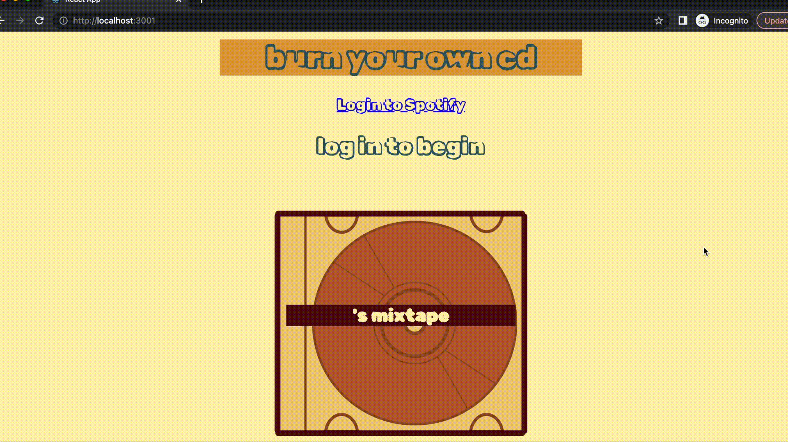
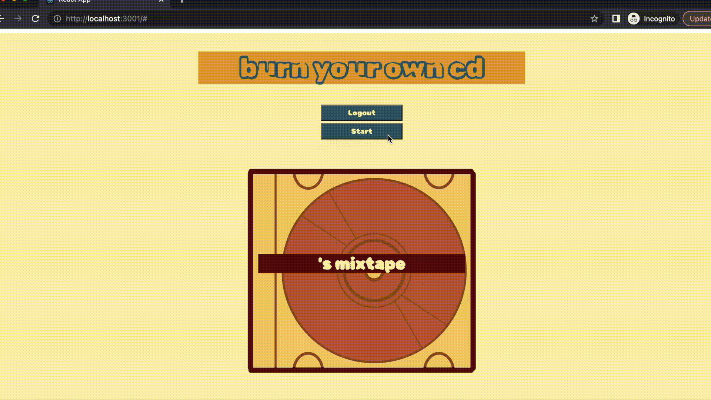
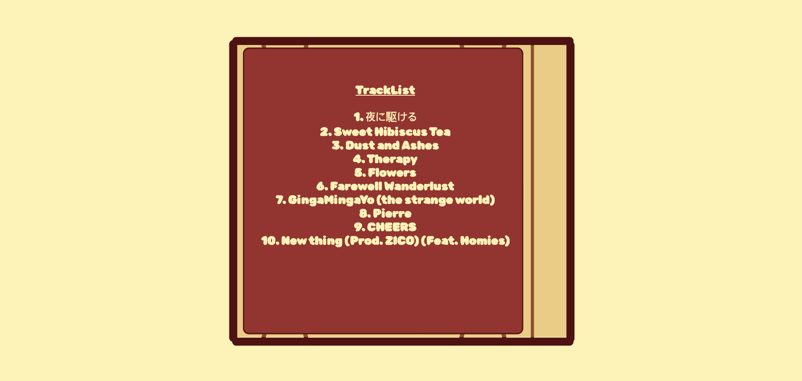

# retroCD
[12.2022] utilizes Spotify API to obtain users top statistics

# About the Project

# Features
### Authorization
all users have to authenticate before using the app

### Pressing Start
app obtains users displayname and adds it to the mixtape

### Top 10 Artists of All Time
displays the top 10 artists for the user
 

### Top 10 Tracks of All Time
displays the top 10 tracks for the user
 

### Built Using
- Visual Studio Code
- Javascript
- HTML/CSS
- React
- Canva (graphic design)

### Contact
Any comments, questions, or concerns?
Contact Jacqueline Molina: molina.jq19@gmail.com
